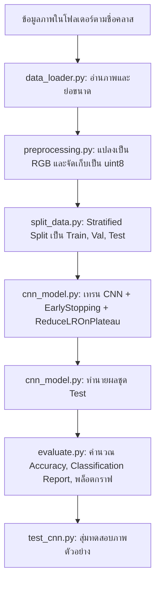

# ECG Heart Disease Classification using Convolutional Neural Network (CNN)

โครงงานจำแนกประเภทโรคหัวใจจากภาพคลื่นไฟฟ้าหัวใจ (ECG Images) ด้วยโครงข่ายประสาทเทียมแบบคอนโวลูชัน (Convolutional Neural Network: CNN) พัฒนาบนพื้นฐานของ TensorFlow/Keras, OpenCV และ Scikit-learn

---

## 📌 บทนำและภาพรวม (Overview)

โครงงานนี้ถูกออกแบบมาเพื่อจำแนกประเภทความผิดปกติของหัวใจจากภาพคลื่นไฟฟ้าหัวใจ (ECG) โดยคำนึงถึงลักษณะทางกายภาพของข้อมูลประเภทคลื่นสัญญาณ:
1. **การรักษาตำแหน่งทางพื้นที่ (Spatial Alignment):** ใช้เลเยอร์ `Flatten` แทน `GlobalAveragePooling2D` เพื่อไม่ให้เสียตำแหน่งยอดคลื่น (P-Q-R-S-T peaks)
2. **หลีกเลี่ยง Data Augmentation สุ่มเสี่ยง:** ไม่ใช้ Random Flip, Rotation หรือ Zoom ที่อาจทำให้ทิศทางและจังหวะของรูปคลื่นผิดเพี้ยนไปจากมาตรฐานทางการแพทย์
3. **การประหยัดหน่วยความจำ:** เก็บข้อมูลเป็น `uint8` แล้วให้โมเดลทำ `Rescaling(1.0 / 255)` ภายในตัวเอง
4. **ป้องกัน Overfitting:** ใช้ Regularization ด้วย `BatchNormalization`, `Dropout` และควบคุมการเทรนด้วย `EarlyStopping` ควบคู่กับ `ReduceLROnPlateau`

---

## 📁 โครงสร้างโปรเจกต์ (Project Directory)

```text
ECG_CNN_Project/
├── data_loader.py       # โหลดภาพจากโฟลเดอร์แยกคลาสและปรับขนาดภาพ
├── preprocessing.py     # แปลงระบบสี BGR/GRAY เป็น RGB และเตรียมฟีเจอร์ uint8
├── split_data.py        # แบ่งชุดข้อมูลแบบ Stratified (Train 70% / Val 10% / Test 20%)
├── cnn_model.py         # นิยามโครงสร้างสถาปัตยกรรม CNN, การคอมไพล์ และการเทรน
├── evaluate.py          # ประเมินประสิทธิภาพ (Accuracy, Report, Confusion Matrix, กราฟ History)
├── test_cnn.py          # สุ่มตัวอย่างภาพ 4 ภาพมาพล็อตผลการทำนายพร้อมค่า Confidence
├── main.py              # ไปป์ไลน์หลัก รันกระบวนการตั้งแต่ขั้นตอนที่ 1 ถึง 6
├── outputs/             # โฟลเดอร์เก็บผลลัพธ์อัตโนมัติ
│   ├── cnn_model.keras  # น้ำหนักโมเดลที่ดีที่สุด
│   ├── history.json     # บันทึกประวัติ Loss และ Accuracy
│   ├── classes.json     # รายชื่อคลาส
│   ├── *.npy            # ไฟล์ Numpy array ของชุดข้อมูล
│   ├── training_history.png
│   ├── confusion_matrix.png
│   └── prediction_sample.png
└── README.md
```

---

## ⚙️ ข้อกำหนดและไลบรารีที่จำเป็น (Requirements)

ติดตั้งไลบรารีที่จำเป็นผ่านคำสั่ง:

```bash
pip install tensorflow opencv-python scikit-learn matplotlib numpy
```

---

## 🚀 ลำดับขั้นตอนการทำงาน (Workflow)



---

## 💻 ซอร์สโค้ดฉบับสมบูรณ์ (Complete Source Code)

### 1. `preprocessing.py`
จัดการแปลงรูปภาพให้อยู่ในระบบสี RGB และย่อขนาดภาพด้วย `INTER_AREA` ซึ่งเหมาะสำหรับการลดขนาดภาพ

```python
import cv2
import numpy as np


def preprocess_image(image, img_size=100):
    """Resize one image to img_size x img_size RGB. None if unusable."""
    if image is None or image.size == 0:
        return None

    # cv2 reads BGR; convert to RGB so images display correctly
    if image.ndim == 2:
        image = cv2.cvtColor(image, cv2.COLOR_GRAY2RGB)
    else:
        image = cv2.cvtColor(image, cv2.COLOR_BGR2RGB)

    # Resize image (INTER_AREA is the best filter for shrinking)
    image = cv2.resize(
        image,
        (img_size, img_size),
        interpolation=cv2.INTER_AREA
    )
    return image


def to_features(images):
    """(n, h, w, 3) uint8 -> array consumed by the model.
    Data stays uint8 to save memory; Rescaling layer handles 0-1 normalization.
    """
    return np.ascontiguousarray(images, dtype=np.uint8)
```

---

### 2. `data_loader.py`
โหลดรูปภาพจากโฟลเดอร์ย่อยตามชื่อคลาส พร้อมตรวจสอบข้อผิดพลาดกรณีไม่พบโฟลเดอร์

```python
import os
import cv2
import numpy as np

from preprocessing import preprocess_image

VALID_EXT = (".jpg", ".jpeg", ".png", ".bmp")


def load_data(data_path, img_size=100, max_per_class=None):
    if not os.path.isdir(data_path):
        raise FileNotFoundError(
            f"Dataset directory not found: {os.path.abspath(data_path)}\n"
            "Please check the DATA_PATH variable in main.py."
        )

    images = []
    labels = []

    # Detect classes automatically from subdirectories
    classes = sorted([
        folder
        for folder in os.listdir(data_path)
        if os.path.isdir(os.path.join(data_path, folder))
    ])
    print("Detected classes:", classes)

    for label, class_name in enumerate(classes):
        class_path = os.path.join(data_path, class_name)
        filenames = sorted(
            f for f in os.listdir(class_path)
            if f.lower().endswith(VALID_EXT)
        )

        loaded = 0
        skipped = 0
        for filename in filenames:
            if max_per_class and loaded >= max_per_class:
                break

            image_path = os.path.join(class_path, filename)
            image = cv2.imread(image_path)

            image = preprocess_image(image, img_size)
            if image is None:
                skipped += 1
                continue

            images.append(image)
            labels.append(label)
            loaded += 1

        print(f"Loaded class {class_name}: {loaded} images ({skipped} skipped)")

    return np.stack(images), np.array(labels), classes
```

---

### 3. `split_data.py`
แบ่งชุดข้อมูลออกเป็น Train, Validation และ Test โดยใช้วิธี Stratified Split เพื่อรักษาสัดส่วนของแต่ละคลาสให้เท่าเทียมกัน

```python
import numpy as np
from sklearn.model_selection import train_test_split


def split_dataset(X, y, test_size=0.2, val_size=0.1):
    """Split into train / validation / test using stratified sampling."""
    y = np.asarray(y)

    # First carve off the test set
    X_train, X_test, y_train, y_test = train_test_split(
        X, y,
        test_size=test_size,
        random_state=42,
        stratify=y
    )

    # Carve validation set out of what remains
    val_ratio = val_size / (1.0 - test_size)
    X_train, X_val, y_train, y_val = train_test_split(
        X_train, y_train,
        test_size=val_ratio,
        random_state=42,
        stratify=y_train
    )

    return X_train, X_val, X_test, y_train, y_val, y_test
```

---

### 4. `cnn_model.py`
โครงสร้างโมเดล CNN 3 บล็อกคอนโวลูชัน พร้อมฟังก์ชันฝึกสอนและฟังก์ชันทำนายผล

```python
import json
import os
from tensorflow import keras
from tensorflow.keras import layers


def build_model(input_shape, num_classes):
    """CNN Architecture for ECG Image Classification."""
    model = keras.Sequential([
        keras.Input(shape=input_shape),
        layers.Rescaling(1.0 / 255),

        # Block 1
        layers.Conv2D(32, (3, 3), activation="relu", padding="same"),
        layers.BatchNormalization(),
        layers.MaxPooling2D((2, 2)),

        # Block 2
        layers.Conv2D(64, (3, 3), activation="relu", padding="same"),
        layers.BatchNormalization(),
        layers.MaxPooling2D((2, 2)),

        # Block 3
        layers.Conv2D(128, (3, 3), activation="relu", padding="same"),
        layers.BatchNormalization(),
        layers.MaxPooling2D((2, 2)),

        # Classifier Head
        layers.Flatten(),
        layers.Dense(128, activation="relu"),
        layers.BatchNormalization(),
        layers.Dropout(0.4),
        layers.Dense(num_classes, activation="softmax")
    ])

    model.compile(
        optimizer=keras.optimizers.Adam(learning_rate=3e-4),
        loss="sparse_categorical_crossentropy",
        metrics=["accuracy"]
    )
    return model


def train_model(X_train, y_train, X_val, y_val, num_classes,
                output_dir=None, epochs=30, batch_size=32):
    """Build, train, and save the model."""
    model = build_model(X_train.shape[1:], num_classes)
    model.summary()

    callbacks = [
        keras.callbacks.EarlyStopping(
            monitor="val_loss", patience=7, restore_best_weights=True
        ),
        keras.callbacks.ReduceLROnPlateau(
            monitor="val_loss", factor=0.5, patience=3, min_lr=1e-6
        )
    ]

    print("\nTraining CNN Model on ECG Images...")
    history = model.fit(
        X_train, y_train,
        validation_data=(X_val, y_val),
        epochs=epochs,
        batch_size=batch_size,
        callbacks=callbacks,
        verbose=1
    )

    if output_dir:
        os.makedirs(output_dir, exist_ok=True)
        model.save(os.path.join(output_dir, "cnn_model.keras"))
        with open(os.path.join(output_dir, "history.json"), "w") as f:
            json.dump({k: [float(v) for v in vs] for k, vs in history.history.items()}, f)
        print(f"Saved: {os.path.join(output_dir, 'cnn_model.keras')}")

    return model, history


def predict_model(model, X_test):
    """Predict class indices."""
    probabilities = model.predict(X_test, verbose=0)
    return probabilities.argmax(axis=1)
```

---

### 5. `evaluate.py`
คำนวณสถิติการจำแนกประเภทและวาดกราฟ Confusion Matrix รวมถึง Learning Curves

```python
import matplotlib
matplotlib.use("Agg")

import matplotlib.pyplot as plt
import numpy as np
from sklearn.metrics import (
    accuracy_score,
    classification_report,
    confusion_matrix
)


def evaluate_model(y_test, predictions, classes, save_path=None):
    labels = list(range(len(classes)))
    accuracy = accuracy_score(y_test, predictions)

    print("\n------------ Evaluation ------------------")
    print(f"Accuracy: {accuracy * 100:.2f}%")

    print("\nClassification Report:")
    report = classification_report(
        y_test,
        predictions,
        labels=labels,
        target_names=classes,
        zero_division=0
    )
    print(report)

    print("Confusion Matrix:")
    matrix = confusion_matrix(y_test, predictions, labels=labels)
    print(matrix)

    if save_path:
        plot_confusion_matrix(matrix, classes, save_path)
        print(f"Saved: {save_path}")

    return accuracy


def plot_confusion_matrix(matrix, classes, save_path):
    fig, ax = plt.subplots(figsize=(8, 8))
    ax.imshow(matrix, cmap="Blues")

    ax.set_xticks(np.arange(len(classes)))
    ax.set_yticks(np.arange(len(classes)))

    short_classes = [c.split("(")[0].strip() for c in classes]
    ax.set_xticklabels(short_classes, rotation=30, ha="right", fontsize=8)
    ax.set_yticklabels(short_classes, fontsize=8)

    ax.set_xlabel("Predicted Label")
    ax.set_ylabel("True Label")
    ax.set_title("Confusion Matrix")

    threshold = matrix.max() / 2 if matrix.max() > 0 else 0
    for i in range(len(classes)):
        for j in range(len(classes)):
            ax.text(j, i, matrix[i, j], ha="center", va="center",
                    color="white" if matrix[i, j] > threshold else "black")

    fig.tight_layout()
    fig.savefig(save_path, dpi=150)
    plt.close(fig)


def plot_history(history, save_path):
    """Accuracy and loss curves for monitoring overfitting."""
    fig, axes = plt.subplots(1, 2, figsize=(11, 4))

    axes[0].plot(history.history["accuracy"], label="train")
    axes[0].plot(history.history["val_accuracy"], label="validation")
    axes[0].set_xlabel("Epoch")
    axes[0].set_ylabel("Accuracy")
    axes[0].set_title("Accuracy")
    axes[0].legend()

    axes[1].plot(history.history["loss"], label="train")
    axes[1].plot(history.history["val_loss"], label="validation")
    axes[1].set_xlabel("Epoch")
    axes[1].set_ylabel("Loss")
    axes[1].set_title("Loss")
    axes[1].legend()

    fig.tight_layout()
    fig.savefig(save_path, dpi=150)
    plt.close(fig)
    print(f"Saved: {save_path}")
```

---

### 6. `test_cnn.py`
สุ่มรูปจากชุดทดสอบ 4 รูปมาพล็อตตาราง $2 \times 2$ พร้อมแสดงผลจริงและค่าความมั่นใจ (Confidence)

```python
import json
import os

import matplotlib
matplotlib.use("Agg")

import matplotlib.pyplot as plt
import numpy as np
from tensorflow import keras

BASE_DIR = os.path.dirname(os.path.abspath(__file__))
OUTPUT_DIR = os.path.join(BASE_DIR, "outputs")

N_SAMPLES = 4


def test_cnn(n_samples=N_SAMPLES):
    model = keras.models.load_model(os.path.join(OUTPUT_DIR, "cnn_model.keras"))
    X_test = np.load(os.path.join(OUTPUT_DIR, "X_test.npy"))
    y_test = np.load(os.path.join(OUTPUT_DIR, "y_test.npy"))
    with open(os.path.join(OUTPUT_DIR, "classes.json")) as f:
        classes = json.load(f)

    index = np.random.choice(len(X_test), n_samples, replace=False)
    X_sample = X_test[index]
    y_sample = y_test[index]

    probabilities = model.predict(X_sample, verbose=0)
    predictions = probabilities.argmax(axis=1)
    confidence = probabilities.max(axis=1)

    cols = int(np.ceil(np.sqrt(n_samples)))
    rows = int(np.ceil(n_samples / cols))
    fig, axes = plt.subplots(rows, cols, figsize=(3.4 * cols, 4.0 * rows))
    axes = np.atleast_1d(axes).ravel()

    for i, ax in enumerate(axes):
        if i >= n_samples:
            ax.axis("off")
            continue

        pred = classes[predictions[i]]
        true = classes[y_sample[i]]
        correct = (predictions[i] == y_sample[i])
        color = "green" if correct else "red"

        ax.imshow(X_sample[i])
        ax.set_xticks([])
        ax.set_yticks([])
        ax.set_title(f"Pred: {pred} ({confidence[i] * 100:.0f}%)\nTrue: {true}", color=color)

        print(f"[{i + 1}] Pred: {pred:<10} True: {true:<10} "
              f"conf {confidence[i] * 100:5.1f}%  "
              f"{'OK' if correct else 'WRONG'}")

    correct_total = int((predictions == y_sample).sum())
    print(f"\nCorrect: {correct_total}/{n_samples}")

    fig.suptitle(f"Prediction: {correct_total}/{n_samples} correct")
    fig.tight_layout()

    save_path = os.path.join(OUTPUT_DIR, "prediction_sample.png")
    fig.savefig(save_path, dpi=150)
    plt.close(fig)
    print(f"Saved: {save_path}")


if __name__ == "__main__":
    test_cnn()
```

---

### 7. `main.py`
สคริปต์หลักสำหรับควบคุมไปป์ไลน์ทั้งหมด

```python
import json
import os

import numpy as np

from data_loader import load_data
from preprocessing import to_features
from split_data import split_dataset
from cnn_model import train_model, predict_model
from evaluate import evaluate_model, plot_history

BASE_DIR = os.path.dirname(os.path.abspath(__file__))
# ตรวจสอบเส้นทาง Dataset ให้ถูกต้องตามเครื่องของคุณ
DATA_PATH = r"C:\ML-CPE\LAB05\ECG_DATA\train"
OUTPUT_DIR = os.path.join(BASE_DIR, "outputs")

IMG_SIZE = 100
TEST_SIZE = 0.2
VAL_SIZE = 0.1
MAX_PER_CLASS = 3000   # None = ใช้ภาพทั้งหมดในแต่ละคลาส
EPOCHS = 30
BATCH_SIZE = 32


def main():
    print("--" * 30)
    print("Neural Network Image Recognition: ECG Heart Disease Classification")
    print("--" * 30)

    os.makedirs(OUTPUT_DIR, exist_ok=True)

    # Step 1: Load Dataset
    print("\n[Step 1] Loading dataset...")
    images, labels, classes = load_data(DATA_PATH, IMG_SIZE, MAX_PER_CLASS)

    np.save(os.path.join(OUTPUT_DIR, "labels.npy"), labels)
    with open(os.path.join(OUTPUT_DIR, "classes.json"), "w") as f:
        json.dump(classes, f)

    print("\nDataset loaded successfully.")
    print(f"Total images : {len(images)}")
    print(f"Classes      : {classes}")

    # Step 2: Preprocessing
    print("\n[Step 2] Preprocessing images...")
    X = to_features(images)
    y = labels
    np.save(os.path.join(OUTPUT_DIR, "features.npy"), X)
    print(f"Feature shape: {X.shape}")

    # Step 3: Split Dataset
    print("\n[Step 3] Splitting dataset...")
    X_train, X_val, X_test, y_train, y_val, y_test = split_dataset(
        X, y, TEST_SIZE, VAL_SIZE
    )

    np.save(os.path.join(OUTPUT_DIR, "X_train.npy"), X_train)
    np.save(os.path.join(OUTPUT_DIR, "X_val.npy"), X_val)
    np.save(os.path.join(OUTPUT_DIR, "X_test.npy"), X_test)
    np.save(os.path.join(OUTPUT_DIR, "y_train.npy"), y_train)
    np.save(os.path.join(OUTPUT_DIR, "y_val.npy"), y_val)
    np.save(os.path.join(OUTPUT_DIR, "y_test.npy"), y_test)

    print(f"Training samples  : {len(X_train)}")
    print(f"Validation samples: {len(X_val)}")
    print(f"Testing samples   : {len(X_test)}")

    # Step 4: Train Model
    print("\n[Step 4] Training model...")
    model, history = train_model(
        X_train, y_train, X_val, y_val, len(classes),
        OUTPUT_DIR, EPOCHS, BATCH_SIZE
    )
    print("Training completed.")

    # Step 5: Prediction
    print("\n[Step 5] Testing model...")
    predictions = predict_model(model, X_test)

    # Step 6: Evaluation
    print("\n[Step 6] Evaluating model...")
    evaluate_model(
        y_test, predictions, classes,
        save_path=os.path.join(OUTPUT_DIR, "confusion_matrix.png")
    )
    plot_history(history, os.path.join(OUTPUT_DIR, "training_history.png"))


if __name__ == "__main__":
    main()
```