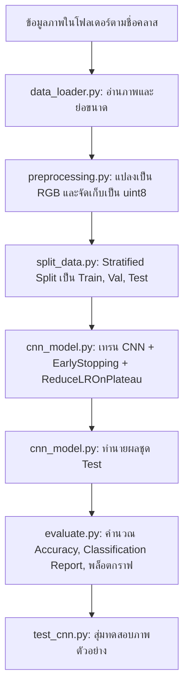

# ECG Heart Disease Classification using Convolutional Neural Network (CNN)

โครงงานจำแนกประเภทโรคหัวใจจากภาพคลื่นไฟฟ้าหัวใจ (ECG Images) ด้วยโครงข่ายประสาทเทียมแบบคอนโวลูชัน (Convolutional Neural Network: CNN) พัฒนาบนพื้นฐานของ TensorFlow/Keras, OpenCV และ Scikit-learn

---

## 📌 บทนำและภาพรวม (Overview)

โครงงานนี้ถูกออกแบบมาเพื่อจำแนกประเภทความผิดปกติของหัวใจจากภาพคลื่นไฟฟ้าหัวใจ (ECG) โดยคำนึงถึงลักษณะทางกายภาพของข้อมูลประเภทคลื่นสัญญาณ:
1. **การรักษาตำแหน่งทางพื้นที่ (Spatial Alignment):** ใช้เลเยอร์ `Flatten` แทน `GlobalAveragePooling2D` เพื่อไม่ให้เสียตำแหน่งยอดคลื่น (P-Q-R-S-T peaks)
2. **หลีกเลี่ยง Data Augmentation สุ่มเสี่ยง:** ไม่ใช้ Random Flip, Rotation หรือ Zoom ที่อาจทำให้ทิศทางและจังหวะของรูปคลื่นผิดเพี้ยนไปจากมาตรฐานทางการแพทย์
3. **การประหยัดหน่วยความจำ:** เก็บข้อมูลเป็น `uint8` แล้วให้โมเดลทำ `Rescaling(1.0 / 255)` ภายในตัวเอง
4. **ป้องกัน Overfitting:** ใช้ Regularization ด้วย `BatchNormalization`, `Dropout` และควบคุมการเทรนด้วย `EarlyStopping` ควบคู่กับ `ReduceLROnPlateau`

---

## 📁 โครงสร้างโปรเจกต์ (Project Directory)

```text
ECG_CNN_Project/
├── data_loader.py       # โหลดภาพจากโฟลเดอร์แยกคลาสและปรับขนาดภาพ
├── preprocessing.py     # แปลงระบบสี BGR/GRAY เป็น RGB และเตรียมฟีเจอร์ uint8
├── split_data.py        # แบ่งชุดข้อมูลแบบ Stratified (Train 70% / Val 10% / Test 20%)
├── cnn_model.py         # นิยามโครงสร้างสถาปัตยกรรม CNN, การคอมไพล์ และการเทรน
├── evaluate.py          # ประเมินประสิทธิภาพ (Accuracy, Report, Confusion Matrix, กราฟ History)
├── test_cnn.py          # สุ่มตัวอย่างภาพ 4 ภาพมาพล็อตผลการทำนายพร้อมค่า Confidence
├── main.py              # ไปป์ไลน์หลัก รันกระบวนการตั้งแต่ขั้นตอนที่ 1 ถึง 6
├── outputs/             # โฟลเดอร์เก็บผลลัพธ์อัตโนมัติ
│   ├── cnn_model.keras  # น้ำหนักโมเดลที่ดีที่สุด
│   ├── history.json     # บันทึกประวัติ Loss และ Accuracy
│   ├── classes.json     # รายชื่อคลาส
│   ├── *.npy            # ไฟล์ Numpy array ของชุดข้อมูล
│   ├── training_history.png
│   ├── confusion_matrix.png
│   └── prediction_sample.png
└── README.md
```

---

## ⚙️ ข้อกำหนดและไลบรารีที่จำเป็น (Requirements)

ติดตั้งไลบรารีที่จำเป็นผ่านคำสั่ง:

```bash
pip install tensorflow opencv-python scikit-learn matplotlib numpy
```

---

## 🚀 ลำดับขั้นตอนการทำงาน (Workflow)



